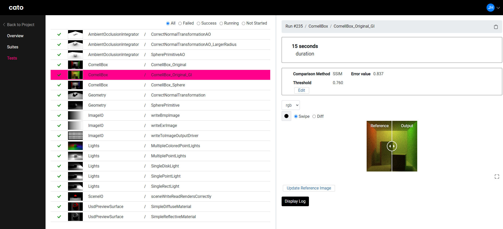
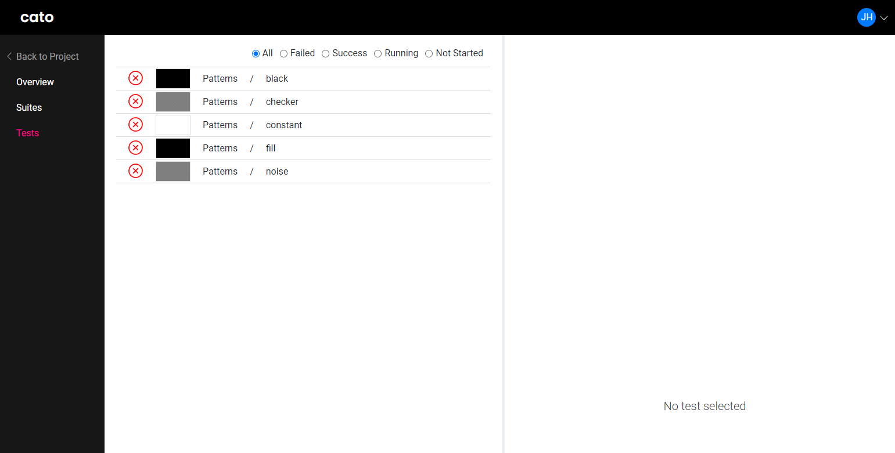
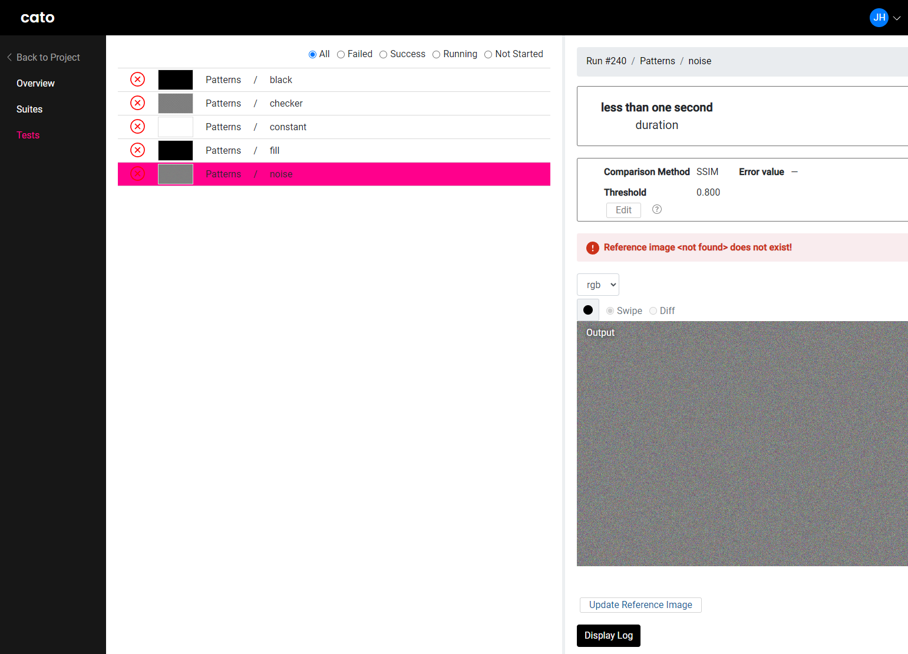
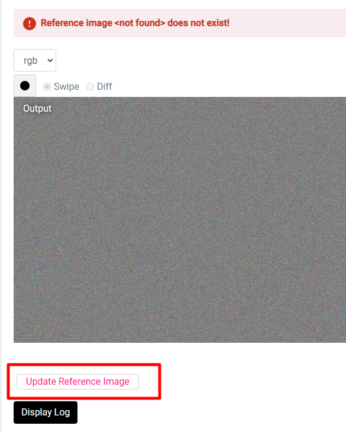
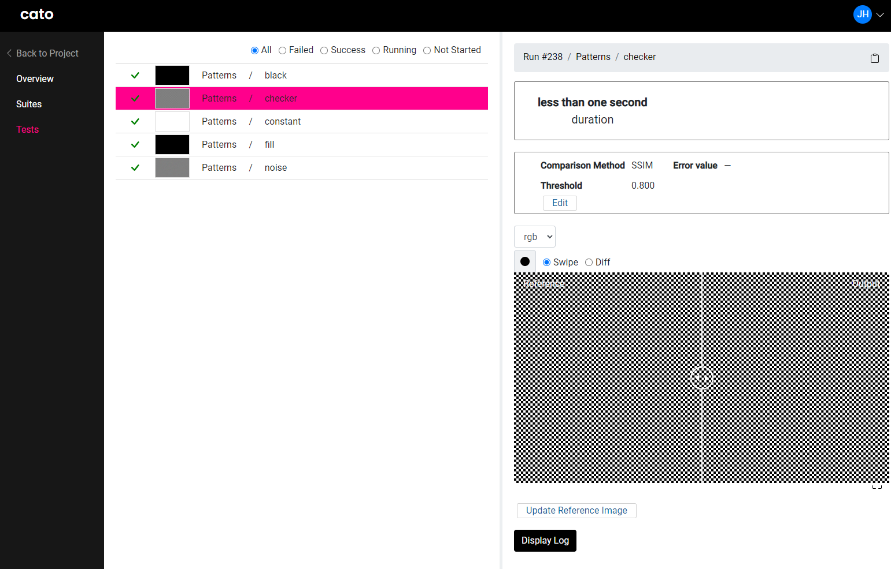
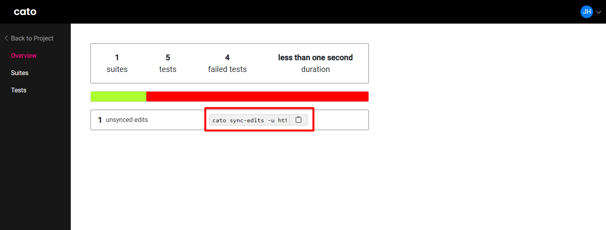
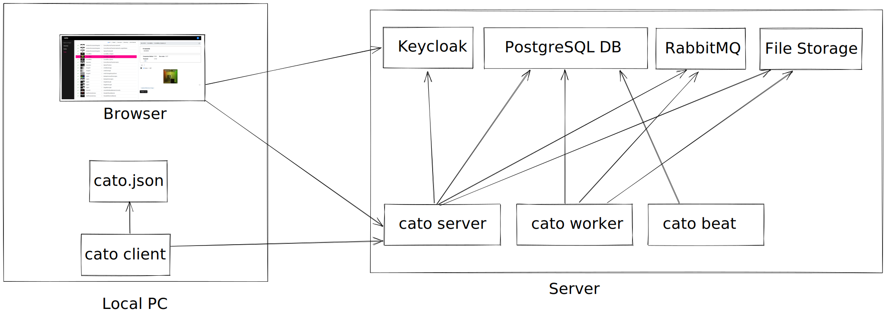

# Cato

Cato is a visual regression testing tool intended for the development of final-frame renderers. The results can be
reviewed in a Browser interface.



<!-- TOC -->
* [Cato](#cato)
  * [Inspiration](#inspiration)
  * [How does it work?](#how-does-it-work)
    * [Features](#features)
      * [Developer Features](#developer-features)
  * [How to use it?](#how-to-use-it)
  * [Architecture](#architecture)
  * [Design Decisions](#design-decisions)
    * [Client / Server Architecture](#client--server-architecture)
    * [Serving the Frontend from Cato Server](#serving-the-frontend-from-cato-server)
    * [why only run command tests](#why-only-run-command-tests)
    * [Gradle](#gradle)
    * [FastApi?](#fastapi)
    * [why rely on external scheduler like Deadline?](#why-rely-on-external-scheduler-like-deadline)
    * [Comparing Images on Server](#comparing-images-on-server)
    * [Deduplicating File Storage](#deduplicating-file-storage)
    * [task queue for image processing](#task-queue-for-image-processing)
    * [Login using Keycloak / OIDC](#login-using-keycloak--oidc)
<!-- TOC -->

## Inspiration

Cato is inspired by a similar tool developed internally by Chaos, the developers of V-Ray.
The tool was demonstrated by Vlado Koylazov at "Total Chaos 2019" (see the video of the
presentation [here](https://youtu.be/UkvWdr_LhDo?t=2415), presentation
slided [here](https://docs.google.com/presentation/d/e/2PACX-1vQyTIC_VpILmmA7kXcXtZVuRKkSbdf0lf-tJYX6vudrRenAEStd-6lHZLjNk4igJDj7O72mneDmygO2/pub?slide=id.g578e9019e1_2_48))
.

I really liked the idea of the tool and was looking for something similiar for the development of my own
hobby-renderer [Crayg](https://github.com/Latios96/crayg). I couldn't find something similar, so Cato was born.

## How does it work?

A config file defines suites and tests. Every test is expected to produce some kind of image on the file system (_output
image_). The `cato client` reads this config file, executes the tests and
uploads the output image and expected reference images to the `cato server`. The `cato server` compares the images
respecting a per-test threshold and returns the result of the comparison. The server stores the images and test results
for review in a web interface.

### Features

**Review results in Browser**

- View and compare images using A/B swiping
- View diff images visualizing the error distribution over the image
- View all channels of a multichannel OpenEXR file in the browser
- Inspect failed tests and log output of test command
- Filter tests by failure reason

**Edit tests in Browser**

- Update reference images and comparison settings in the browser
- Edits can be easily synced back locally using CLI, a command to do that can be generated in UI

**Support for relevant image formats**

Supported image formats are:

- OpenEXR
- PNG
- JPEG

**Deduplicating File Storage**

Reference and output images (especially reference images) usually don't change that often over time. It's therefore
obvious to not store them multiple times. See also [Deduplicating File Storage](#deduplicating-file-storage).

**Easy config files with variable substitution**

See [How to use it?](#how-to-use-it) for an example.

**Local and distributed test execution**

- Tests can be executed on a single machine, which is the default.
- It is also possible to distribute the execution using an external scheduler, for
  example [AWS Thinkbox Deadline](https://www.awsthinkbox.com/deadline).
- Currently, only Deadline is supported, but this could be extended to OpenCue for example.

#### Developer Features

- Fully automated build using Gradle
- High test coverage using Unit and Integration tests

## How to use it?

**1. Install client**

The client can be easily installed from your instance using `pip`:

```shell
pip install {your-instance-url}/static/cato-client-0.0.0-py3-none-any.whl
```

**2. Create a config file**

You can create a config file using `cato client`:

```shell
cato config-template .
```

This will create a config template at the specified path.

Here is an example config file, which uses oiiotool to generate some image output:

```json
{
  "projectName": "oiiotool Demo",
  "serverUrl": "your-instance-url",
  "suites": [
    {
      "name": "Patterns",
      "variables": {
        "oiiotool_command": "oiiotool --pattern {{test_name}} 1280x720 3 -o {{image_output_png}}"
      },
      "tests": [
        {
          "name": "black",
          "command": "{{oiiotool_command}}"
        },
        {
          "name": "constant",
          "command": "{{oiiotool_command}}"
        },
        {
          "name": "fill",
          "command": "{{oiiotool_command}}"
        },
        {
          "name": "checker",
          "command": "{{oiiotool_command}}"
        },
        {
          "name": "noise",
          "command": "{{oiiotool_command}}"
        }
      ]
    }
  ]
}
```

You can see, that the command is only defined once as `oiiotool_command` and is then referenced
by `{{oiiotool_command}}`. There are also some useful predefined variables like `{{test_name}}`
or `{{image_output_png}}`. `{{image_output_png}}` is the path where `cato client` expects the rendered image to be
stored.

**3. Run config**

You can run the tests from your config file using

```shell
cato run
```

This will also print out an url where you can inspect your test results in the browser.

**Inspect Results**

Once you visit this url, you will be presented with an overview over all executed tests:



Currently, all tests failed because no reference images exist. Select one test to check the result:



The image looks good for us, so we can click on the `Update Reference Image` button below:



The reference image will be updated:



We repeat that for all tests. Now we need to bring back the updated reference images locally. By navigating to the
overview page of the run, we can copy the `sync` command to sync our reference images back:



## Architecture



**Cato Client**

Responsible for test execution, reporting to server

**Cato Server**

Offers Rest API to store test results in the PostgreSQL database and on the file storage.

**Browser**

Displays the UI, talks to Rest API. For Logins, the browser is redirected to the Keycloak instance.

**Cato Worker**

Offloaded Image Processing

**Cato Beat**
Schedule recurring tasks, for example every 2 minutes timed out tests are removed.


## Design Decisions

### Client / Server Architecture

A Client / Server Architecture was chosen for the following reasons. An alternative would have been a locally created HTML report os something similar.

- Editing of reference images / comparison settings
  - Would also be possible with a local solution, but this would also require some kind of backend 
- Distributed test execution
  - easy to collect results using a central instance.
- Easily collect information over multiple runs
- Run tests in CI: view results as they are produced
- Easily share run results (just copy link)

### Serving the Frontend from Cato Server

Serving the Frontend from `cato server` means that only one Python wheel needs to be installed and started, which greatly simplifies deployment.

### Gradle

While Gradle is quite common in the Java world, not many people would expect that in a Python / Typescript project. However, I wanted a fully automated build. Executing the build task will do:
    - install Python deps
    - install Typescript deps
    - run Python Unittests
    - run Typescript Unittests
    - build React app
    - run Integration tests
    - build different Python wheels for client and server

With Gradle, it's possible to define dependencies between tasks, so all dependent tasks are also executed when executing one task. The task results are also cached and when no inputs to the task changes, the task is not executed again. Also, the tasks are executed in parallel if possible.


### Why relying on external scheduler like Deadline

Developing a scheduler is a complicated task with many challenges:
- distribute load over multiple machines
- restart failed tasks
- ignore failing machines
- run certain things only on one OS
- ...

Deadline was chosen because I had many experience with running Deadline and developing for it. There are no restrictions to extended Cato to use OpenCue, for example.

### Comparing Images on Server

Images are compared on the server to make the client smaller and easier to distribute. Otherwise, this would currently require to install OpenImageIO on any client machine, which is challenging, since there are no public Windows builds available. Also, a server side implementation was needed anyway for editing reference images in Browser.

### Deduplicating File Storage

Images are often the same for multiple runs:
- Reference images are always the same if not updated
- output images are most of the time the same, they are only different if a test fails or they involve some kind of noise

To save storage space, they are deduplicated by checksum and only stored once.

### Using a task queue for image processing

Image processing can be quite slow, which can lead to HTTP request timeouts otherwise.

### Login using Keycloak / OIDC

Implementing a Login / user managment can be very hard and since it's critical for application security, this is also
not a good idea. Keycloak is ready to use and easy to integrate. Advanced login features (for example Two-Factor-Authentication) just need to be configured and don't need to be implemented. 